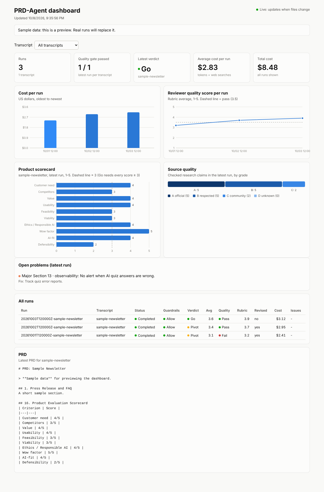

# Dashboard (Phase 8)

A static web page that shows every PRD-Agent run. No build tools: plain HTML, CSS and JavaScript.



## What it shows
- **Key numbers:** runs, quality gate passes, latest verdict, average and total cost.
- **Cost per run** (bars) and **Reviewer quality score per run** (line, with the 3.5 pass line).
- **Product scorecard** for the latest run (10 criteria, with the "Go needs ≥ 3" line).
- **Source quality:** research claims by grade A–D.
- **Open problems:** critical and major Reviewer findings, and quotes not found on their page.
- **All runs** table and the **latest PRD**.
- A **transcript filter** at the top that updates everything below it.

Hover (or tab to) any bar or point to see its numbers. Light and dark mode follow your system setting. Colors come from a checked palette that works for color-blind readers, and every status color also has a word next to it.

## Run it on your computer (live)
```bash
python -m apps.dashboard.serve          # open http://localhost:8000
python -m apps.dashboard.serve --demo   # sample data, clearly labelled
```
Leave it open. When a run writes new files (or you edit the dashboard), the page **updates by itself** within about 2 seconds.

## Publish it on GitHub Pages
`.github/workflows/dashboard.yml` rebuilds and publishes the site when run data or the dashboard changes on `main`, and after every `prd-agent` Action run.

**One-time setup:** repo **Settings → Pages → Build and deployment → Source: GitHub Actions**. The site address appears there (usually `https://<user>.github.io/<repo>/`). To put that link in alert emails, add it as a repository *variable* named `DASHBOARD_URL`.

> **Privacy:** a GitHub Pages site is public, even for a private repo on most plans. Only publish if your transcripts and PRDs are OK to share.

## Files
- `static/`: the page (`index.html`, `style.css`, `app.js`)
- `build.py`: gathers `data/metrics/index.json` and the latest outputs into `data.json`
- `serve.py`: local server with live reload

**Figma (optional):** you can sketch layout changes in Figma first, then change `static/`. Figma isn't needed to run anything.
